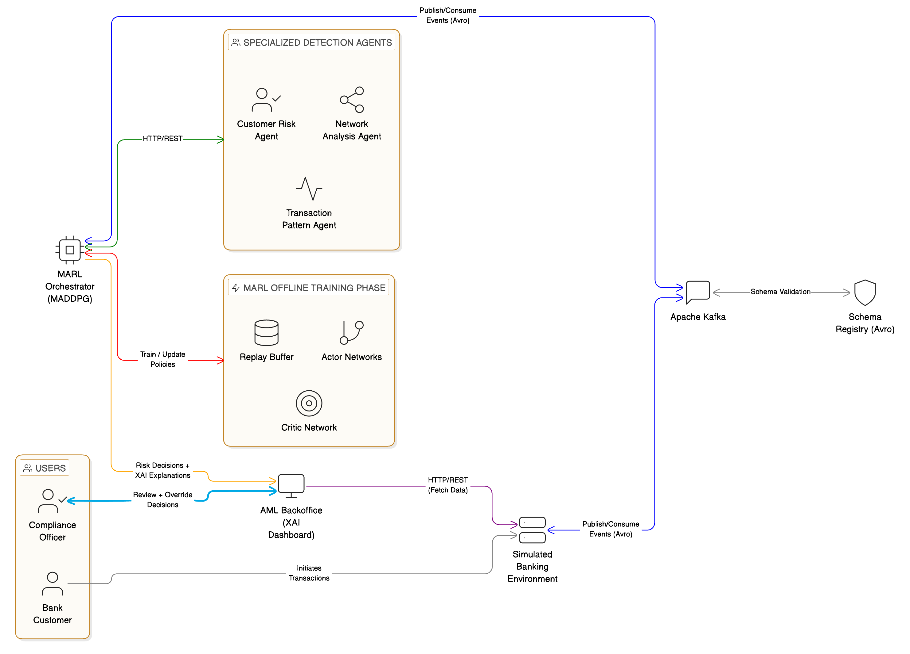
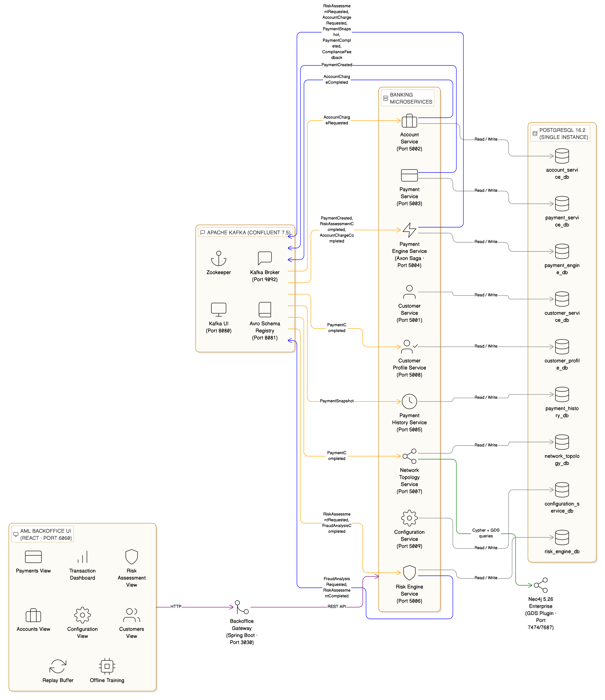
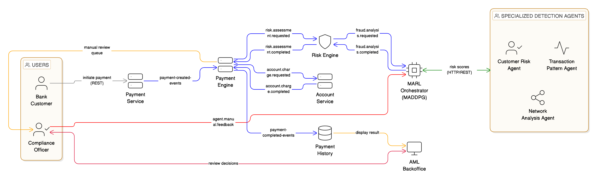
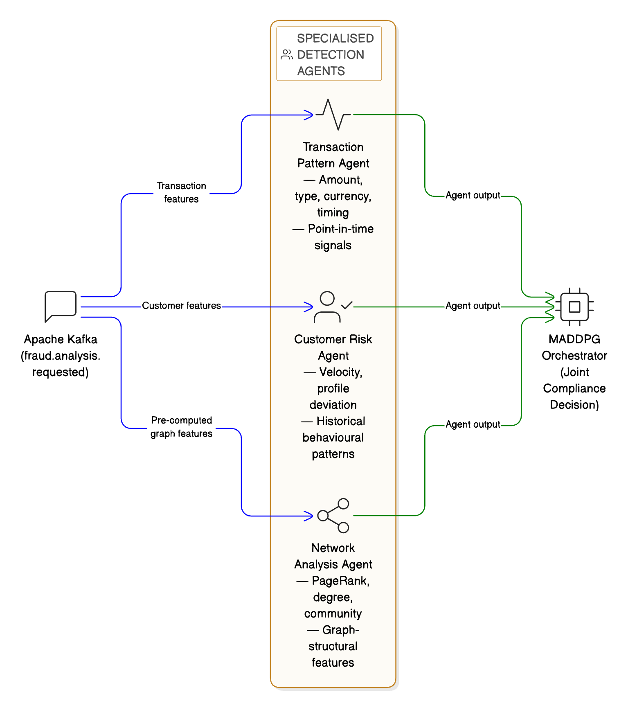
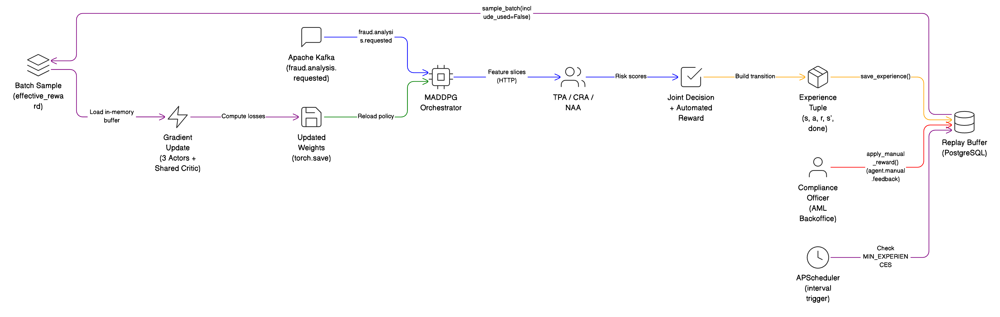
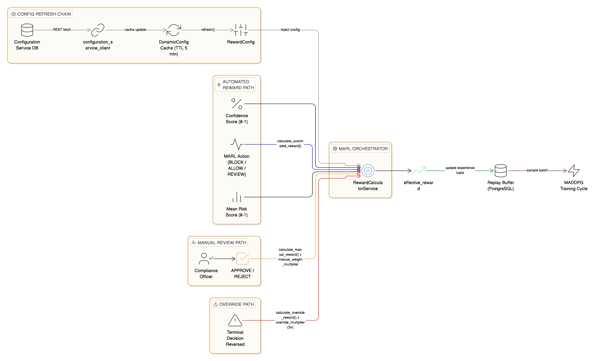
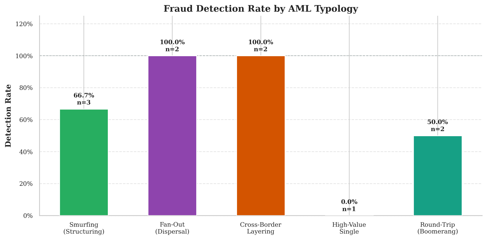
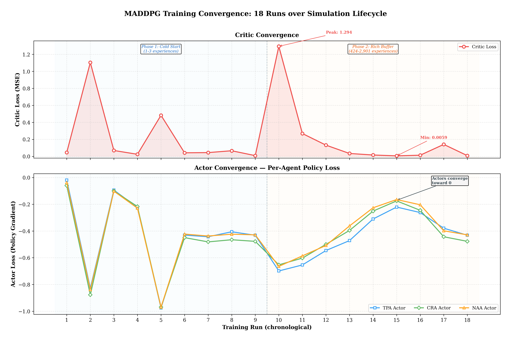

# Multi-Agents in Fintech Regulatory Compliance

[](https://opensource.org/licenses/MIT)

> **MSc Artificial Intelligence — University of Liverpool**
>
> A cooperative multi-agent reinforcement learning system for Anti-Money Laundering detection, built as a production-grade, event-driven microservices ecosystem.

---

## 📖 Overview

Traditional AML systems rely on static rules with false-positive rates exceeding 95 %, costing billions in manual review while sophisticated laundering schemes go undetected. This project replaces the rule-based paradigm with three specialised ML agents that learn to cooperate through Multi-Agent Deep Deterministic Policy Gradient (MADDPG), producing a single auditable compliance decision for every payment.

The system is designed to be **adaptive** (agents learn from officer feedback at runtime), **collaborative** (independent agents cover different fraud dimensions), and **explainable** (TreeSHAP + Integrated Gradients provide per-decision attribution).

---

## 🏗️ System Architecture

The platform runs as **22 Docker containers** — 10 Java microservices, 3 Python ML agents, 1 MADDPG orchestrator, and supporting infrastructure — communicating exclusively through Apache Kafka with Avro schemas (zero synchronous coupling).

<p align="center">
  
  <br/>
  <em>Figure 1 — High-Level System Design: 22 containers across three Docker Compose stacks.</em>
</p>

### Simulated Banking Environment

Every payment traverses a deterministic compliance workflow orchestrated by Axon Framework's saga pattern, producing over **300,000 immutable domain events** in a single simulation run.

<p align="center">
  
  <br/>
  <em>Figure 2 — Simulated Banking Environment: 10 Java microservices connected via Kafka.</em>
</p>

### Payment Processing Lifecycle

<p align="center">
  
  <br/>
  <em>Figure 3 — Payment Processing Lifecycle: Axon saga orchestrating risk assessment, agent analysis, and compliance decisioning.</em>
</p>

### Agent Decomposition

Three specialised agents each analyse fraud from a different dimension:

| Agent | Model | Key Features | Port |
|-------|-------|-------------|------|
| **Transaction Pattern Agent** | XGBoost | 57 features (after one-hot), trained on 9.5M+ transactions | 1001 |
| **Customer Risk Agent** | XGBoost + SMOTE | 19 behavioural features aggregated over 30-day sliding window | 1002 |
| **Network Analysis Agent** | CatBoost | 11 graph-topology features (PageRank, centrality, clustering) — deliberately volume-free | 1003 |

<p align="center">
  
  <br/>
  <em>Figure 4 — Agent Decomposition: each agent covers a distinct fraud dimension and exposes a FastAPI endpoint.</em>
</p>

### MADDPG Orchestrator

A centralised-training, decentralised-execution (CTDE) architecture: three Actor networks (one per agent) + one shared Critic (~415 K parameters total). Training uses a **three-tier reward function** — automated heuristics, officer review, and decision overrides — with configurable multipliers hot-reloadable at runtime.

<p align="center">
  
  <br/>
  <em>Figure 5 — MADDPG Training Loop: centralised Critic trains on joint state-action pairs; Actors execute decentralised.</em>
</p>

<p align="center">
  
  <br/>
  <em>Figure 6 — Three-Tier Reward Calculation: automated heuristics → officer review → decision override.</em>
</p>

---

## 📊 Evaluation Results

Evaluated on **10,000 synthetic payments** across five money-laundering typologies:

| Metric | Value |
|--------|-------|
| **System Recall** | 97.3 % |
| **Smurfing** | 99.3 % |
| **Fan-out** | 100 % |
| **Layering** | 99.6 % |
| **High-value** | 100 % |
| **Round-trip** | 76 % (hardest typology) |
| **Precision** | 11 % (by design — missed fraud carries regulatory risk; false alerts route to human review) |
| **Training Convergence** | 18 episodes, 99.5 % critic-loss reduction |
| **Median Latency** | 779 ms per decision |

<p align="center">
  
  <br/>
  <em>Figure 7 — Detection Recall by Typology: five laundering patterns across 10,000 payments.</em>
</p>

<p align="center">
  
  <br/>
  <em>Figure 8 — Training Convergence: critic loss and reward trajectory over 18 episodes.</em>
</p>

---

## 🛠️ Tech Stack

| Layer | Technology |
|-------|-----------|
| **Backend** | Java 25, Spring Boot 4.0, Axon Framework 4.12 (saga pattern) |
| **ML Agents** | Python 3.11, FastAPI, XGBoost, CatBoost |
| **MARL** | PyTorch 2.5.1, MADDPG (custom implementation) |
| **Explainability** | SHAP 0.51, Integrated Gradients |
| **Messaging** | Apache Kafka 7.5, Confluent Schema Registry, Avro |
| **Databases** | PostgreSQL 16.2, Neo4j 5.26 |
| **Frontend** | React 18, TypeScript, Tailwind CSS, Vite |
| **Infrastructure** | Docker, Docker Compose |

---

## 📂 Repository Structure

```
├── ai-services/
│   ├── agents/
│   │   ├── transaction_pattern_agent/   # XGBoost — port 1001
│   │   ├── customer_risk_agent/         # XGBoost — port 1002
│   │   └── network_analysis_agent/      # CatBoost — port 1003
│   └── marl_orchestrator/               # MADDPG orchestrator — port 1004
├── bank-solution-backend/
│   ├── account-service/
│   ├── customer-service/
│   ├── customer-profile-service/
│   ├── configuration-service/
│   ├── payment-service/
│   ├── payment-engine-service/
│   ├── payment-history-service/
│   ├── risk-engine-service/
│   ├── network-topology-service/
│   └── backoffice-gateway/
├── bank-solution-backoffice/            # React backoffice UI
├── libraries/
│   └── avro-schema-library/             # Kafka, Zookeeper, Schema Registry & Avro schemas
├── simulation_tests/                    # 10K-payment evaluation suite
├── data/                                # SAML-D dataset (9.5M+ rows)
└── docs/design/                         # Architecture diagrams
```

---

## 🚀 Getting Started

### Prerequisites

- Docker & Docker Compose
- Java 25+
- Python 3.11+
- Node.js 18+

### Step 1 — Start Kafka Infrastructure

Kafka, Zookeeper, Schema Registry, and Kafka UI live in the `avro-schema-library` stack. This must come up first because every other component depends on it.

```bash
cd libraries/avro-schema-library
./scripts/start-infrastructure.sh
```

Once the Schema Registry is healthy, register the Avro schemas and create the Kafka topics:

```bash
./scripts/register-schemas.sh
./scripts/create-kafka-topics.sh
```

> **Alternatively**, run everything in one go:
> ```bash
> ./scripts/setup-complete.sh
> ```

### Step 2 — Start Backend Infrastructure (PostgreSQL, Neo4j) & Microservices

```bash
cd bank-solution-backend
docker compose up -d
```

This brings up PostgreSQL 16.2, Neo4j 5.26, all 10 Java microservices (with Liquibase migrations), and the backoffice gateway.

### Step 3 — Start AI Agents & MADDPG Orchestrator

```bash
cd ai-services
docker compose up -d
```

Starts the three ML agents (ports 1001–1003), the MADDPG orchestrator (port 1004), and its PostgreSQL database.

### Step 4 — Start Backoffice UI (optional, for compliance officer dashboard)

```bash
cd bank-solution-backoffice
npm install && npm run dev
```

The React UI will be available at `http://localhost:5173`.

### Service URLs

| Service | URL | Port |
|---------|-----|------|
| **Infrastructure** | | |
| PostgreSQL | `localhost:5433` | 5433 |
| Neo4j Browser | http://localhost:7474 | 7474 |
| Neo4j Bolt | `localhost:7687` | 7687 |
| Kafka Broker | `localhost:9092` | 9092 |
| Schema Registry | http://localhost:8081 | 8081 |
| Kafka UI | http://localhost:8080 | 8080 |
| **Backend Microservices** | | |
| Customer Service | http://localhost:5001 | 5001 |
| Account Service | http://localhost:5002 | 5002 |
| Payment Service | http://localhost:5003 | 5003 |
| Payment Engine Service | http://localhost:5004 | 5004 |
| Payment History Service | http://localhost:5005 | 5005 |
| Risk Engine Service | http://localhost:5006 | 5006 |
| Network Topology Service | http://localhost:5007 | 5007 |
| Customer Profile Service | http://localhost:5008 | 5008 |
| Configuration Service | http://localhost:5009 | 5009 |
| Backoffice Gateway | http://localhost:3030 | 3030 |
| **AI Services** | | |
| Transaction Pattern Agent | http://localhost:1001 | 1001 |
| Customer Risk Agent | http://localhost:1002 | 1002 |
| Network Analysis Agent | http://localhost:1003 | 1003 |
| MADDPG Orchestrator | http://localhost:1004 | 1004 |
| MADDPG Orchestrator DB | `localhost:5438` | 5438 |
| **Frontend** | | |
| Backoffice UI (Docker) | http://localhost:6060 | 6060 |
| Backoffice UI (dev) | http://localhost:5173 | 5173 |

---

## 📄 License

This project is licensed under the MIT License. See the [LICENSE](LICENSE) file for details.

---

## 📊 Dataset

This project uses the [**Synthetic AML Transaction Monitoring Dataset (SAML-D)**](https://www.kaggle.com/datasets/berkanoztas/synthetic-transaction-monitoring-dataset-aml) — a typology-based AML dataset containing 9.5 M+ transactions across five laundering patterns (smurfing, fan-out, layering, high-value, round-trip).

Credit to [**Berkan Öztaş**](https://github.com/BOztasUK) for making this dataset publicly available on Kaggle.

> B. Öztaş, D. Çetinkaya, F. Adedoyin, M. Budka, H. Doğan, and G. Aksu, "Enhancing Anti-Money Laundering: Development of a Synthetic Transaction Monitoring Dataset," *2023 IEEE International Conference on e-Business Engineering (ICEBE)*, Sydney, Australia, 2023, pp. 47–54, doi: [10.1109/ICEBE59045.2023.00028](https://doi.org/10.1109/ICEBE59045.2023.00028).

---

## 🙏 Acknowledgements

This dissertation was completed as part of the MSc in Computer Science at the **University of Liverpool**. Sincere gratitude to **Dr. Chunyan Mu** for her guidance and support throughout this research.
